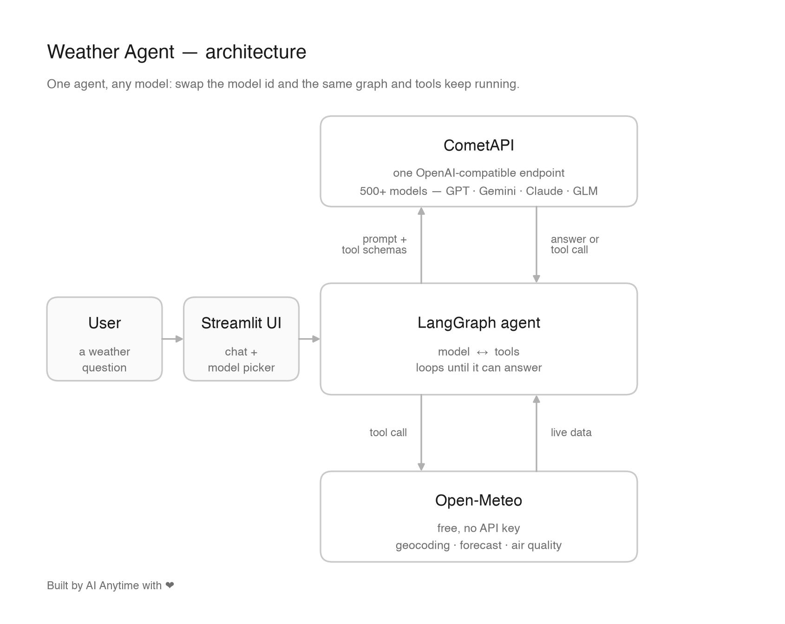

# Weather Agent

A minimal AI agent that answers weather questions with real data. Built with
[LangGraph](https://langchain-ai.github.io/langgraph/) and served through
[CometAPI](https://www.cometapi.com/), an OpenAI-compatible endpoint that fronts
500+ models — so the same agent runs on GPT, Gemini, Claude, DeepSeek or GLM by
changing one string.

The tools call [Open-Meteo](https://open-meteo.com/), which is free and needs no key.



## What it does

Ask something like *"Is it good weather for a run in Bengaluru today?"* and the agent:

1. `find_place` — turns the place name into coordinates
2. `get_weather` — current conditions plus a 3-day forecast
3. `get_air_quality` — European AQI, PM2.5, PM10

It loops model → tools → model until it has enough data, then answers in a few
sentences. Every tool call is visible in the UI.

## Setup

```bash
uv venv --python 3.12 .venv          # or: python3 -m venv .venv
source .venv/bin/activate
uv pip install -r requirements.txt   # or: pip install -r requirements.txt

cp .env.example .env                 # then add your key from
                                     # https://www.cometapi.com/console/token
streamlit run app.py
```

Run the agent without the UI:

```bash
python agent.py
```

## Files

| File | Purpose |
| --- | --- |
| `agent.py` | Tools, graph and model wiring |
| `app.py` | Streamlit chat UI with a model picker |
| `make_diagram.py` | Regenerates `architecture.jpg` |

## Notes

- Model ids are just strings — add any id from `GET /v1/models` to `MODELS` in `app.py`.
- Responses are capped at 500 tokens to keep runs cheap.
- Availability of individual models can vary on the gateway; if one errors, pick another.

---

Built by AI Anytime with ❤️

## License

Proprietary — all rights reserved. This code is published for viewing and evaluation only; no use, copying, modification, redistribution, commercial use, or use as AI/ML training data without written permission. See [LICENSE](LICENSE). Commercial licensing: aianytime07@gmail.com · sonu@aianytime.net.
